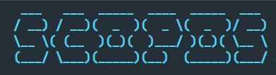
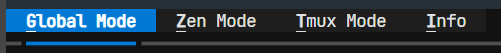
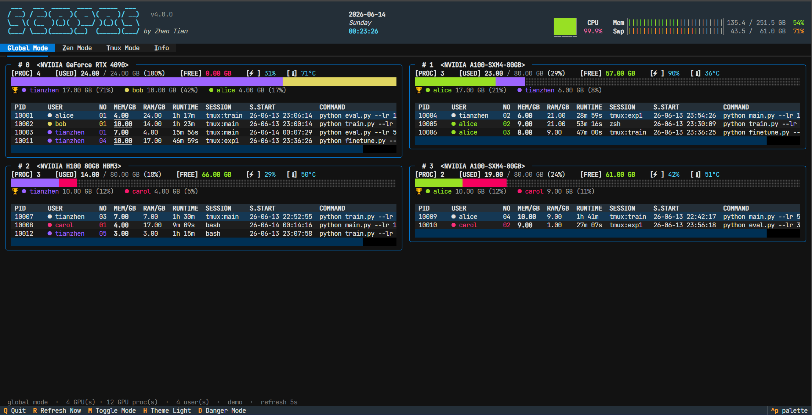
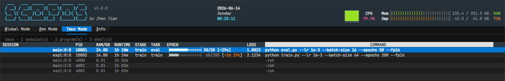
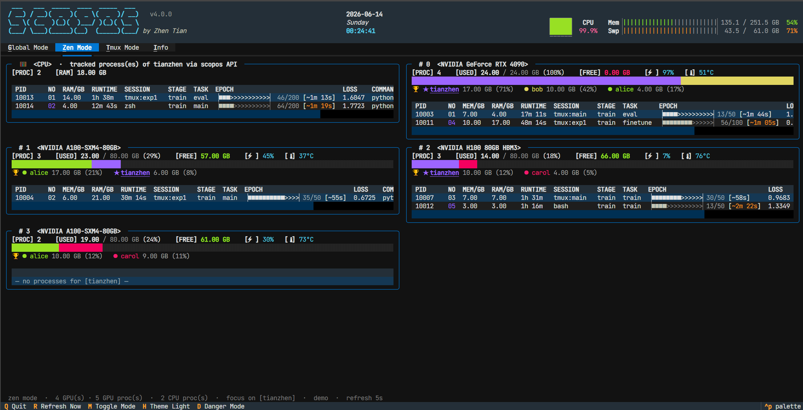

<div align="center">

<p align="center">
  
  <br>
  <strong>A user-centric NVIDIA GPU monitor for the terminal</strong>
</p>

[](https://pypi.org/project/scopos/)


</div>

## About

`SCOPOS` is a [Textual](https://textual.textualize.io/)-based terminal UI for monitoring NVIDIA GPUs, grouped by user so you can tell at a glance who is using what. Beyond live memory, utilisation and temperature, it offers focused `Zen` and `Tmux` views, a lightweight Python API for your training scripts to report live status (progress bars with an ETA, loss, stage, …), and a guarded kill mode for cleaning up stray processes — right-click to copy, batch-select to terminate. The layout and theme are tunable from a single config file.

- Python: 3.8+

## Installation

### Install with pipx

`pipx` installs the application in an isolated environment while making
the command globally available.

```bash
pip install pipx
pipx ensurepath
```

```bash
pipx install scopos
```

## Quick Start

### monitor all GPUs

```bash
scopos
```

### highlight user "alice" and show their task details

```bash
scopos -u alice
```

### refresh every 2 seconds

```bash
scopos -i 2
```

### synthetic data, no NVIDIA driver needed

```bash
scopos --demo
```

### start in zen (focus) mode

```bash
scopos -u alice --zen
```

---

## Tabs / modes



A tab bar under the logo switches between four views (cycle with <kbd>m</kbd>,
or jump with <kbd>g</kbd> / <kbd>z</kbd> / <kbd>t</kbd> / <kbd>i</kbd>; start on
one with `-m/--mode`):

- **Global** — every GPU, every user (the classic layout).



- **Zen** — focused on `-u/--user` (see below).
- **Tmux** — *your own* tmux processes in one flat, grid-style table (same
  columns and interactions as the cards), grouped by `session:win.pane`. Idle
  pane shells are dimmed so the programs actually running stand out.
  Right-click a row to copy it; in danger mode you can also kill the process,
  its whole pane, or its whole session (multi-process kills list every affected
  process and ask for confirmation).



- **Info** — scopos version and this host's basic specs (CPU, RAM, GPUs).

> tmux sockets are per-user, so the Tmux tab shows the tmux server of the user
> running `scopos`.

## Zen mode



Switch to **zen mode** (<kbd>z</kbd>, or start with `-m zen`), a focused layout
meant to be paired with `-u/--user`:

- Each GPU's **table** lists only the watched user's processes.
- The per-GPU **bar and legend still show every user** — the watched user is
  highlighted (`★`, bold) so you keep the full picture at a glance.
- The table drops the `USER` and `S.START` columns and instead shows the
  **live fields each process reports** through the Python API below — including
  animated progress bars.
- A resident **`CPU` card** lists every process of the watched user that reports
  to scopos but isn't currently on a GPU — extending the monitor to plain CPU
  jobs (e.g. data preprocessing) and to jobs still importing CUDA / loading
  data. It shows host RAM instead of GPU memory; once a job allocates GPU
  memory it simply appears under its GPU as well.

Every process row shows both `MEM/GB` (GPU memory) and `RAM/GB` (host memory).
The `SESSION` column shows the **tmux session name** (`tmux:<name>`) for
tmux-managed processes — for your own sessions; other users' tmux sockets
aren't readable, so those fall back to `tmux`. Determinate progress bars also
show an **ETA** (`· ~3m 20s`) estimated from how fast the bar is advancing.

## Mouse & shortcuts

- **Hover** any cell to see its full, untruncated content as a tooltip. Built-in
  columns (like `COMMAND`) are width-capped to keep rows compact; user-reported
  metadata columns are always shown in full.
- **Right-click** a process row for a menu: *Copy row info* copies that row's
  fields to the clipboard.
- **Danger mode** (<kbd>ctrl</kbd>+<kbd>shift</kbd>+<kbd>k</kbd>) is an
  independent toggle that works in every mode. While it is on, the right-click
  menu also offers **Kill**, which shows the full details and asks for
  confirmation before sending a terminate signal. The status bar shows a red
  `⚠ DANGER` reminder while it is armed.
- **Batch kill**: in danger mode a checkbox column appears; click it to tick
  rows (ticked rows float to the top so they stay visible across refreshes,
  and the row cursor is preserved too). Right-click → *Kill N selected* to kill
  them together. Press <kbd>c</kbd> to clear all ticks.

The bottom status bar also shows scopos's own CPU% / memory footprint.

## Tuning the layout & theme

All the cosmetic knobs live in one place — [`src/scopos/config.py`](src/scopos/config.py).
You can either edit that file, or **override any of it without touching the
source** by dropping a `config.toml` (or `config.json`) into `~/.scopos`
(honours `$SCOPOS_HOME`). Only the keys you list are overridden. Restart
`scopos` after changing anything.

**Layout / spacing**

- `COLUMN_WIDTHS` — per-column width caps (clipped cells show `…`; `None` =
  auto-size). Metadata columns are always shown in full.
- `COLUMN_VISIBLE` — show/hide any built-in column.
- `TABLE_CELL_PADDING` — the gap between columns.
- `CARD_MIN_WIDTH` / `CARD_MAX_WIDTH` — how wide GPU cards get (and thus how
  many tile per row).
- `GRID_GUTTER` / `GRID_PADDING` / `CARD_PADDING` — spacing around and inside
  cards.
- `TABLE_MAX_HEIGHT` — how tall a table grows before it scrolls.

**Colours / theme**

- `USER_PALETTE` / `WATCH_USER_COLOR` — per-user colours and the watched user's
  colour.
- `PROGRESS_COLOR` / `BAR_TRACK_COLOR` — progress-bar fill and track.
- `COLOR_OK` / `COLOR_WARN` / `COLOR_CRIT` and the `*_WARN` / `*_CRIT`
  thresholds — the green/yellow/red status colours for GPU free memory, the
  host RAM meter and temperature.

Example `~/.scopos/config.toml`:

```toml
card_min_width = 90
table_cell_padding = 2

[column_widths]
COMMAND = 30

[column_visible]
"S.START" = false

[colors]
progress = "magenta"
watch_user = "bright_blue"
```

(TOML needs Python 3.11+, or the `tomli` package on older versions;
`config.json` always works.)

## Python API

`scopos` doubles as a tiny library so your scripts can push live status to the
monitor. Importing it is cheap — no Textual or NVIDIA driver required.

```python
import scopos

# Report plain fields (merged into this process's metadata):
scopos.report(stage="train", loss=0.1234, acc="92.5%")

# Report a progress bar. scopos renders it as a live bar in zen mode:
for step in range(total_steps):
    scopos.report(progress=scopos.progress(step, total_steps))  # e.g. 37/100
    ...

# A fraction in [0, 1] works too, and an indeterminate (animated) bar:
scopos.report(loading=scopos.progress())            # bouncing "…"
scopos.report(warmup=scopos.progress(0.5, label="halfway"))

# Drop a field by reporting None; replace everything with set(...):
scopos.report(loss=None)
scopos.set(stage="done")

# Or scope a run and clean up automatically:
with scopos.session(stage="train"):
    train()   # metadata file removed on exit
```

Each process writes `~/.scopos/metadata/<pid>.json`; `scopos` reads it back and,
in zen mode, shows every reported field as a column next to that process. The
file is removed automatically when your program exits (`atexit`). Set
`$SCOPOS_HOME` to relocate the `.scopos` directory.

---

## Requirements

- Python >= 3.8
- `textual` >= 0.60
- `psutil` >= 5.9
- `nvidia-ml-py` >= 12.0

## License

See LICENSE in the repository.

## Links

- [Homepage/Repo](https://github.com/tinchen777/scopos.git)
- [Issues](https://github.com/tinchen777/scopos.git/issues)
